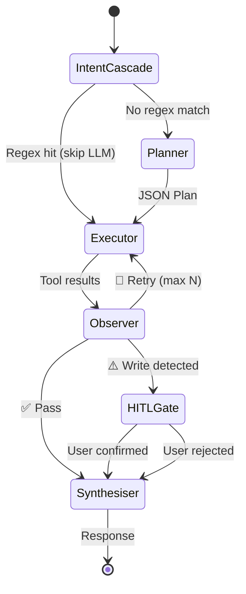
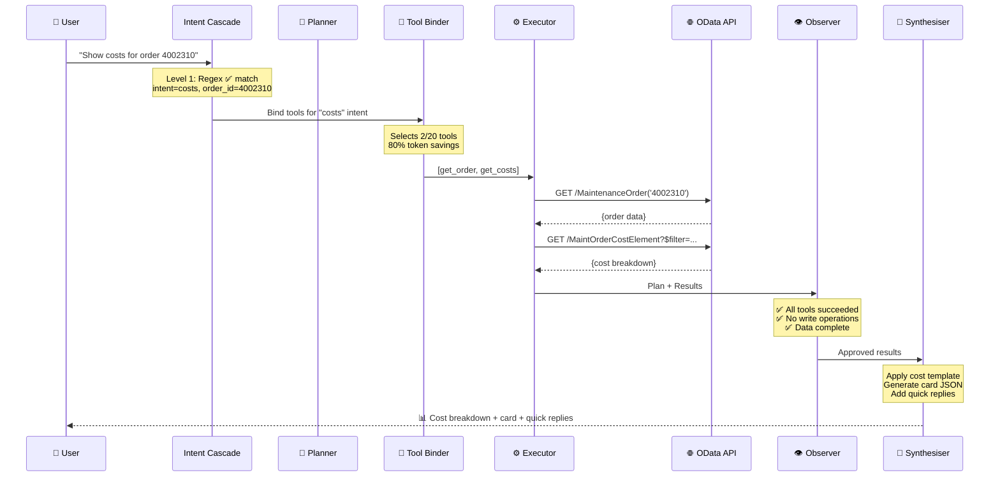
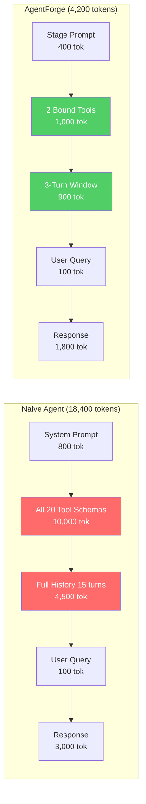
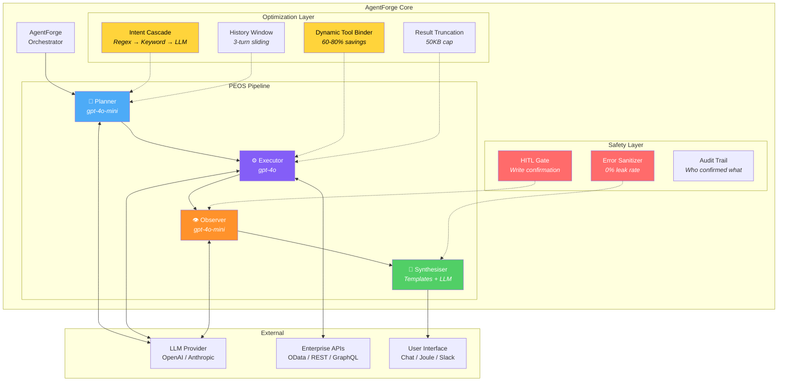
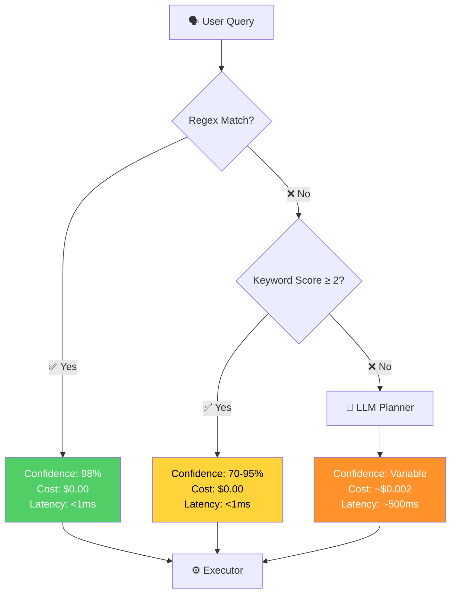

# PEOS Architecture — Technical Deep Dive

## State Machine

```mermaid
stateDiagram-v2
    [*] --> IntentCascade
    
    IntentCascade --> Planner : No regex match
    IntentCascade --> Executor : Regex hit (skip LLM)
    
    Planner --> Executor : JSON Plan
    
    Executor --> Observer : Tool results
    
    Observer --> Synthesiser : ✅ Pass
    Observer --> HITLGate : ⚠️ Write detected
    Observer --> Executor : 🔄 Retry (max N)
    
    HITLGate --> Synthesiser : User confirmed
    HITLGate --> Synthesiser : User rejected
    
    Synthesiser --> [*] : Response
```

## Sequence Diagram — Full Request Lifecycle

```mermaid
sequenceDiagram
    participant U as 👤 User
    participant IC as Intent Cascade
    participant P as 🧠 Planner
    participant TB as 🔧 Tool Binder
    participant E as ⚙️ Executor
    participant API as 🌐 OData API
    participant O as 👁️ Observer
    participant S as 🎨 Synthesiser

    U->>IC: "Show costs for order 4002310"
    
    Note over IC: Level 1: Regex ✅ match<br/>intent=costs, order_id=4002310
    
    IC->>TB: Bind tools for "costs" intent
    Note over TB: Selects 2/20 tools<br/>80% token savings
    
    TB->>E: [get_order, get_costs]
    E->>API: GET /MaintenanceOrder('4002310')
    API-->>E: {order data}
    E->>API: GET /MaintOrderCostElement?$filter=...
    API-->>E: {cost breakdown}
    
    E->>O: Plan + Results
    Note over O: ✅ All tools succeeded<br/>✅ No write operations<br/>✅ Data complete
    
    O->>S: Approved results
    Note over S: Apply cost template<br/>Generate card JSON<br/>Add quick replies
    
    S-->>U: 📊 Cost breakdown + card + quick replies
```

## Token Flow Analysis

```mermaid
flowchart LR
    subgraph "Naive Agent (18,400 tokens)"
        A1[System Prompt<br/>800 tok] --> A2[All 20 Tool Schemas<br/>10,000 tok]
        A2 --> A3[Full History 15 turns<br/>4,500 tok]
        A3 --> A4[User Query<br/>100 tok]
        A4 --> A5[Response<br/>3,000 tok]
    end
    
    subgraph "AgentForge (4,200 tokens)"
        B1[Stage Prompt<br/>400 tok] --> B2[2 Bound Tools<br/>1,000 tok]
        B2 --> B3[3-Turn Window<br/>900 tok]
        B3 --> B4[User Query<br/>100 tok]
        B4 --> B5[Response<br/>1,800 tok]
    end
    
    style A2 fill:#ff6b6b,color:#fff
    style A3 fill:#ff6b6b,color:#fff
    style B2 fill:#51cf66,color:#fff
    style B3 fill:#51cf66,color:#fff
```

## Component Architecture

```mermaid
graph TB
    subgraph "AgentForge Core"
        AF[AgentForge<br/>Orchestrator]
        
        subgraph "PEOS Pipeline"
            P[🧠 Planner<br/><i>gpt-4o-mini</i>]
            E[⚙️ Executor<br/><i>gpt-4o</i>]
            O[👁️ Observer<br/><i>gpt-4o-mini</i>]
            S[🎨 Synthesiser<br/><i>Templates + LLM</i>]
        end
        
        subgraph "Optimization Layer"
            IC[Intent Cascade<br/><i>Regex → Keyword → LLM</i>]
            TB[Dynamic Tool Binder<br/><i>60-80% savings</i>]
            HW[History Window<br/><i>3-turn sliding</i>]
            RT[Result Truncation<br/><i>50KB cap</i>]
        end
        
        subgraph "Safety Layer"
            ES[Error Sanitizer<br/><i>0% leak rate</i>]
            HG[HITL Gate<br/><i>Write confirmation</i>]
            AT[Audit Trail<br/><i>Who confirmed what</i>]
        end
    end
    
    subgraph "External"
        LLM[LLM Provider<br/>OpenAI / Anthropic]
        APIs[Enterprise APIs<br/>OData / REST / GraphQL]
        UI[User Interface<br/>Chat / Joule / Slack]
    end
    
    AF --> P --> E --> O --> S
    IC -.-> P
    TB -.-> E
    HW -.-> P
    RT -.-> E
    ES -.-> S
    HG -.-> O
    E <--> APIs
    P & E & O <--> LLM
    S --> UI
    
    style P fill:#4dabf7,color:#fff
    style E fill:#845ef7,color:#fff
    style O fill:#ff922b,color:#fff
    style S fill:#51cf66,color:#fff
    style IC fill:#ffd43b,color:#000
    style TB fill:#ffd43b,color:#000
    style ES fill:#ff6b6b,color:#fff
    style HG fill:#ff6b6b,color:#fff
```

## Decision Flow — Intent Cascade

```mermaid
flowchart TD
    Q[🗣️ User Query] --> R{Regex Match?}
    
    R -->|✅ Yes| RC[Confidence: 98%<br/>Cost: $0.00<br/>Latency: <1ms]
    R -->|❌ No| K{Keyword Score ≥ 2?}
    
    K -->|✅ Yes| KC[Confidence: 70-95%<br/>Cost: $0.00<br/>Latency: <1ms]
    K -->|❌ No| L[🧠 LLM Planner]
    
    L --> LC[Confidence: Variable<br/>Cost: ~$0.002<br/>Latency: ~500ms]
    
    RC --> EXEC[⚙️ Executor]
    KC --> EXEC
    LC --> EXEC
    
    style RC fill:#51cf66,color:#fff
    style KC fill:#ffd43b,color:#000
    style LC fill:#ff922b,color:#fff
```
